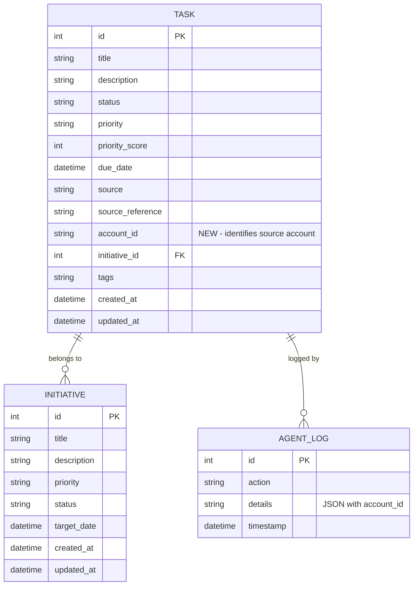

# Add Multi-Account Google Integration Support

## Overview

Enable the Personal Assistant to connect to multiple Google accounts simultaneously (e.g., personal and work), allowing the agent to scan all configured accounts for tasks and initiatives. This involves refactoring the current single-account OAuth architecture to support account arrays with per-account configuration and authentication.

## Problem Statement / Motivation

**Current Limitation:**
The application currently supports only a single Google account connection. Users who have both personal and work Google accounts must choose one, missing important tasks and context from the other account.

**User Impact:**
- Work-life separation is not possible - can't differentiate tasks from personal vs work email
- Manual task entry required for emails from the non-connected account
- Reduced agent effectiveness for multi-account users

**Real-World Use Case:**
A user wants to monitor their personal Gmail (`user@gmail.com`) for family/personal tasks and their work Gmail (`user@company.com`) for work tasks, with different polling intervals and filtering rules for each.

## Proposed Solution

Refactor the Google integration architecture to support multiple accounts:

1. **Configuration**: Change `GoogleConfig` from a single object to an array of account configurations
2. **OAuth Management**: Store separate OAuth tokens per account (e.g., `token.personal.json`, `token.work.json`)
3. **Task Tracking**: Add `account_id` field to tasks to track which Google account sourced them
4. **Integration Manager**: Support multiple Gmail integration instances with composite keys `(IntegrationType, account_id)`
5. **Per-Account Settings**: Enable different polling intervals, filters, and enable/disable toggles per account

## Technical Approach

### Architecture Changes

#### Current Architecture (Single Account)
```
IntegrationManager
├── Gmail Integration (single instance)
│   ├── GoogleOAuthManager (token.json)
│   └── GmailQueryConfig (one config)
└── Integrations dict[IntegrationType, BaseIntegration]
```

#### Proposed Architecture (Multiple Accounts)
```
IntegrationManager
├── Gmail Integrations (multiple instances)
│   ├── Gmail:personal → GmailIntegration(account_id="personal")
│   │   ├── GoogleOAuthManager (token.personal.json)
│   │   └── GmailQueryConfig (personal-specific)
│   └── Gmail:work → GmailIntegration(account_id="work")
│       ├── GoogleOAuthManager (token.work.json)
│       └── GmailQueryConfig (work-specific)
└── Integrations dict[(IntegrationType, str), BaseIntegration]
```

### Implementation Phases

#### Phase 1: Database and Model Updates

**Files to modify:**
- `src/models/task.py`
- `alembic/versions/`

**Tasks:**
1. Add `account_id` field to Task model
   ```python
   # src/models/task.py
   account_id: Mapped[str | None] = mapped_column(
       String(100), nullable=True, index=True
   )
   ```

2. Create Alembic migration
   ```bash
   alembic revision --autogenerate -m "Add account_id to tasks table"
   alembic upgrade head
   ```

3. Update task filtering to support account_id parameter

**Success Criteria:**
- [x] Migration successfully adds `account_id` column
- [x] Existing tasks have NULL `account_id` (backwards compatible)
- [x] Task model includes `account_id` field
- [x] Database queries can filter by `account_id`

**Testing:**
- Unit test: Task model with account_id field
- Integration test: Create task with account_id, query by account_id
- Migration test: Verify existing data preserved

---

#### Phase 2: Configuration Refactoring

**Files to modify:**
- `src/utils/config.py`
- `config.example.yaml`

**Configuration Structure Changes:**

**Before (Single Account):**
```yaml
google:
  enabled: true
  credentials_path: "credentials.json"
  token_path: "token.json"
  scopes:
    - "https://www.googleapis.com/auth/gmail.readonly"
  gmail:
    max_results: 50
    lookback_days: 1
    inbox_type: "unread"
    include_senders: []
    exclude_senders: []
    priority_senders: []
```

**After (Multiple Accounts):**
```yaml
google:
  enabled: true
  accounts:
    - account_id: "personal"
      display_name: "Personal Gmail"
      enabled: true
      credentials_path: "credentials.personal.json"
      token_path: "token.personal.json"
      scopes:
        - "https://www.googleapis.com/auth/gmail.readonly"
      polling_interval_minutes: 15  # Check less frequently
      gmail:
        max_results: 50
        lookback_days: 1
        inbox_type: "unread"
        include_senders: []
        exclude_senders: []
        priority_senders: []

    - account_id: "work"
      display_name: "Work Gmail"
      enabled: true
      credentials_path: "credentials.work.json"
      token_path: "token.work.json"
      scopes:
        - "https://www.googleapis.com/auth/gmail.readonly"
      polling_interval_minutes: 5  # Check more frequently
      gmail:
        max_results: 100
        lookback_hours: 2  # More recent lookback
        inbox_type: "important"
        include_senders: ["@company.com"]
        exclude_senders: ["noreply@"]
        priority_senders: ["boss@company.com", "team@company.com"]
```

**Pydantic Model Changes:**

```python
# src/utils/config.py

class GoogleAccountConfig(BaseModel):
    """Configuration for a single Google account."""
    account_id: str  # Unique identifier (e.g., "personal", "work")
    display_name: str  # Human-readable name
    enabled: bool = True
    credentials_path: str
    token_path: str
    scopes: list[str]
    polling_interval_minutes: int = 5  # Per-account polling interval
    gmail: GmailQueryConfig

    @field_validator("account_id")
    @classmethod
    def validate_account_id(cls, v: str) -> str:
        """Ensure account_id is lowercase, alphanumeric + underscores."""
        if not v.islower() or not v.replace("_", "").isalnum():
            raise ValueError(
                "account_id must be lowercase alphanumeric with underscores only"
            )
        return v


class GoogleConfig(BaseModel):
    """Configuration for Google integrations."""
    enabled: bool = True
    accounts: list[GoogleAccountConfig] = []

    @field_validator("accounts")
    @classmethod
    def validate_unique_account_ids(cls, v: list[GoogleAccountConfig]):
        """Ensure account_id values are unique."""
        account_ids = [acc.account_id for acc in v]
        if len(account_ids) != len(set(account_ids)):
            raise ValueError("account_id values must be unique")
        return v
```

**Backwards Compatibility Strategy:**

To support existing single-account configurations, implement a config migration helper:

```python
# src/utils/config.py

def migrate_legacy_google_config(config_dict: dict) -> dict:
    """
    Migrate old single-account config to new multi-account format.

    Old format:
        google:
          enabled: true
          credentials_path: "credentials.json"
          token_path: "token.json"
          gmail: {...}

    New format:
        google:
          enabled: true
          accounts:
            - account_id: "default"
              credentials_path: "credentials.json"
              ...
    """
    if "google" not in config_dict:
        return config_dict

    google_config = config_dict["google"]

    # Check if already using new format
    if "accounts" in google_config:
        return config_dict

    # Migrate to new format
    if "credentials_path" in google_config:
        # Wrap existing config in accounts array
        legacy_account = {
            "account_id": "default",
            "display_name": "Default Account",
            "enabled": google_config.get("enabled", True),
            "credentials_path": google_config["credentials_path"],
            "token_path": google_config.get("token_path", "token.json"),
            "scopes": google_config.get("scopes", []),
            "polling_interval_minutes": 5,
            "gmail": google_config.get("gmail", {}),
        }
        config_dict["google"] = {
            "enabled": google_config.get("enabled", True),
            "accounts": [legacy_account],
        }

    return config_dict
```

**Success Criteria:**
- [x] Pydantic models validate new array-based structure
- [x] Existing single-account configs automatically migrate
- [x] Account IDs are validated as unique
- [x] Per-account polling intervals supported
- [x] config.example.yaml updated with multi-account example

**Testing:**
- Unit test: Validate GoogleAccountConfig with valid/invalid account_ids
- Unit test: Detect duplicate account_ids
- Unit test: Legacy config migration
- Integration test: Load multi-account config from YAML

---

#### Phase 3: OAuth and Gmail Integration Refactoring

**Files to modify:**
- `src/integrations/gmail_integration.py`
- `src/integrations/base.py` (if BaseIntegration needs changes)

**Gmail Integration Changes:**

```python
# src/integrations/gmail_integration.py

class GmailIntegration(BaseIntegration):
    """Gmail integration with multi-account support."""

    def __init__(
        self,
        account_config: GoogleAccountConfig,  # NEW: full account config
        http_log_callback: HttpLogCallback | None = None,
    ):
        super().__init__(IntegrationType.GMAIL)
        self.account_id = account_config.account_id  # NEW
        self.account_config = account_config
        self.http_log_callback = http_log_callback
        self.oauth_manager: GoogleOAuthManager | None = None
        self.service: Any = None  # Gmail API service
        self.logger = logging.getLogger(__name__)

    async def authenticate(self) -> bool:
        """Authenticate with Google using account-specific OAuth tokens."""
        try:
            self.oauth_manager = GoogleOAuthManager(
                credentials_path=self.account_config.credentials_path,
                token_path=self.account_config.token_path,  # Unique per account
                scopes=self.account_config.scopes,
            )

            creds = self.oauth_manager.get_credentials()
            if not creds:
                self.logger.error(
                    f"Failed to authenticate Gmail account: {self.account_id}"
                )
                return False

            self.service = build("gmail", "v1", credentials=creds)
            self.logger.info(f"Gmail authenticated for account: {self.account_id}")
            return True

        except Exception as e:
            self.logger.error(
                f"Gmail authentication error for {self.account_id}: {e}"
            )
            return False

    async def poll(self) -> list[ActionableItem]:
        """Poll Gmail for actionable emails."""
        if not self.service:
            if not await self.authenticate():
                return []

        gmail_config = self.account_config.gmail

        # ... existing polling logic ...

        # When creating ActionableItem, include account_id
        item = ActionableItem(
            source=IntegrationType.GMAIL,
            title=subject,
            content=f"From: {sender}\n\n{snippet}",
            priority=priority,
            timestamp=msg_date,
            source_reference=msg_id,
            metadata={
                "account_id": self.account_id,  # NEW: Track account
                "thread_id": thread_id,
                "sender": sender,
                "subject": subject,
            },
        )

        return actionable_items
```

**BaseIntegration Changes (if needed):**

```python
# src/integrations/base.py

class BaseIntegration(ABC):
    """Base class for all integrations."""

    def __init__(self, integration_type: IntegrationType, account_id: str | None = None):
        self.integration_type = integration_type
        self.account_id = account_id  # NEW: Optional account identifier
        self.logger = logging.getLogger(self.__class__.__name__)
```

**Success Criteria:**
- [x] GmailIntegration accepts GoogleAccountConfig
- [x] Each instance uses account-specific token file
- [x] ActionableItems include account_id in metadata
- [x] Multiple GmailIntegration instances can coexist
- [x] OAuth flow runs independently per account

**Testing:**
- Unit test: GmailIntegration with account_id parameter
- Unit test: ActionableItem contains account_id metadata
- Integration test: Authenticate two Gmail accounts simultaneously
- Integration test: Poll both accounts, verify account_id in results

---

#### Phase 4: Integration Manager Refactoring

**Files to modify:**
- `src/integrations/manager.py`

**IntegrationManager Changes:**

**Current Key Structure:**
```python
self.integrations: dict[IntegrationType, BaseIntegration]
```

**New Key Structure:**
```python
self.integrations: dict[tuple[IntegrationType, str], BaseIntegration]
# Key format: (IntegrationType.GMAIL, "personal")
# Key format: (IntegrationType.GMAIL, "work")
```

**Implementation:**

```python
# src/integrations/manager.py

class IntegrationManager:
    """Manages all external integrations with multi-account support."""

    def __init__(
        self,
        config: dict,
        http_log_callback: HttpLogCallback | None = None,
    ):
        # NEW: Composite key (IntegrationType, account_id)
        self.integrations: dict[tuple[IntegrationType, str], BaseIntegration] = {}
        self.http_log_callback = http_log_callback
        self.logger = logging.getLogger(__name__)
        self._initialize_integrations(config)

    def _initialize_integrations(self, config: dict):
        """Initialize all enabled integrations."""

        # Initialize Google accounts
        google_config = config.get("google", {})
        if google_config.get("enabled", False):
            accounts = google_config.get("accounts", [])

            for account_config in accounts:
                if not account_config.get("enabled", True):
                    self.logger.info(
                        f"Skipping disabled Google account: {account_config['account_id']}"
                    )
                    continue

                try:
                    # Create GoogleAccountConfig Pydantic object
                    account = GoogleAccountConfig(**account_config)

                    # Initialize Gmail integration for this account
                    gmail = GmailIntegration(
                        account_config=account,
                        http_log_callback=self.http_log_callback,
                    )

                    # Store with composite key
                    key = (IntegrationType.GMAIL, account.account_id)
                    self.integrations[key] = gmail

                    self.logger.info(
                        f"Initialized Gmail integration for account: {account.account_id}"
                    )

                except Exception as e:
                    self.logger.error(
                        f"Failed to initialize Gmail for {account_config.get('account_id')}: {e}"
                    )

        # Slack initialization (unchanged, single account)
        slack_config = config.get("slack", {})
        if slack_config.get("enabled", False):
            try:
                slack = SlackIntegration(
                    token=slack_config["bot_token"],
                    channels=slack_config.get("channels", []),
                    http_log_callback=self.http_log_callback,
                )
                # Slack uses IntegrationType only (no account_id)
                key = (IntegrationType.SLACK, "default")
                self.integrations[key] = slack
                self.logger.info("Initialized Slack integration")
            except Exception as e:
                self.logger.error(f"Failed to initialize Slack: {e}")

    async def poll_all(self) -> list[ActionableItem]:
        """Poll all enabled integrations."""
        all_items = []
        for key, integration in self.integrations.items():
            integration_type, account_id = key
            try:
                self.logger.info(f"Polling {integration_type.value}:{account_id}")
                items = await integration.poll()
                all_items.extend(items)
                self.logger.info(
                    f"Retrieved {len(items)} items from {integration_type.value}:{account_id}"
                )
            except Exception as e:
                self.logger.error(
                    f"Error polling {integration_type.value}:{account_id}: {e}"
                )
        return all_items

    async def poll_account(
        self,
        integration_type: IntegrationType,
        account_id: str,
    ) -> list[ActionableItem]:
        """Poll a specific account."""
        key = (integration_type, account_id)
        integration = self.integrations.get(key)

        if not integration:
            raise ValueError(
                f"Integration not found: {integration_type.value}:{account_id}"
            )

        self.logger.info(f"Polling {integration_type.value}:{account_id}")
        return await integration.poll()

    def get_integration(
        self,
        integration_type: IntegrationType,
        account_id: str = "default",
    ) -> BaseIntegration | None:
        """Get a specific integration instance."""
        key = (integration_type, account_id)
        return self.integrations.get(key)

    def list_accounts(self, integration_type: IntegrationType) -> list[str]:
        """List all account IDs for a given integration type."""
        return [
            account_id
            for (itype, account_id) in self.integrations.keys()
            if itype == integration_type
        ]

    def is_enabled(
        self,
        integration_type: IntegrationType,
        account_id: str | None = None,
    ) -> bool:
        """Check if an integration/account is enabled."""
        if account_id:
            return (integration_type, account_id) in self.integrations
        else:
            # Check if ANY account exists for this integration type
            return any(
                itype == integration_type
                for (itype, _) in self.integrations.keys()
            )
```

**ActionableItem to Task Conversion Update:**

```python
# src/integrations/manager.py

def actionable_item_to_task_params(item: ActionableItem) -> dict:
    """Convert ActionableItem to task creation parameters."""

    # Extract account_id from metadata
    account_id = item.metadata.get("account_id")

    # Map integration type to task source
    source_mapping = {
        IntegrationType.GMAIL: TaskSource.EMAIL,
        IntegrationType.SLACK: TaskSource.SLACK,
        IntegrationType.CALENDAR: TaskSource.CALENDAR,
        IntegrationType.DRIVE: TaskSource.MEETING_NOTES,
    }

    return {
        "title": item.title,
        "description": item.content,
        "priority": priority_mapping.get(item.priority, TaskPriority.MEDIUM),
        "source": source_mapping.get(item.source, TaskSource.AGENT),
        "source_reference": item.source_reference,
        "account_id": account_id,  # NEW: Include account_id
        "tags": [],
    }
```

**Success Criteria:**
- [x] IntegrationManager stores multiple Gmail instances
- [x] Composite key `(IntegrationType, account_id)` used throughout
- [x] `poll_all()` polls all accounts
- [x] `poll_account()` polls specific account
- [x] `list_accounts()` returns all account IDs for integration type
- [x] Tasks created with correct account_id

**Testing:**
- Unit test: Initialize manager with multi-account config
- Unit test: Retrieve integration by composite key
- Unit test: List accounts for Gmail returns ["personal", "work"]
- Integration test: Poll all accounts, verify account_id in tasks
- Integration test: Poll specific account only

---

#### Phase 5: Agent Service Updates

**Files to modify:**
- `src/agent/core.py`
- `src/services/agent_log_service.py`

**Agent Core Changes:**

The agent needs to handle per-account polling intervals. Update the polling logic to respect each account's `polling_interval_minutes` setting.

```python
# src/agent/core.py

class AutonomousAgent:
    """Autonomous agent with multi-account polling support."""

    def __init__(self, config: dict, db_session: Session):
        self.config = config
        self.db_session = db_session
        self.integration_manager = IntegrationManager(
            config=config,
            http_log_callback=self._log_http_request,
        )
        self.llm_service = LLMService(config)
        self.scheduler = BackgroundScheduler()
        self.logger = logging.getLogger(__name__)

    async def start(self, foreground: bool = False):
        """Start the agent with per-account polling schedules."""

        # Schedule polling jobs for each account
        google_config = self.config.get("google", {})
        if google_config.get("enabled", False):
            for account_config in google_config.get("accounts", []):
                if not account_config.get("enabled", True):
                    continue

                account_id = account_config["account_id"]
                interval_minutes = account_config.get("polling_interval_minutes", 5)

                # Schedule per-account polling job
                self.scheduler.add_job(
                    func=self._poll_account,
                    trigger="interval",
                    minutes=interval_minutes,
                    args=[IntegrationType.GMAIL, account_id],
                    id=f"poll_gmail_{account_id}",
                    replace_existing=True,
                )

                self.logger.info(
                    f"Scheduled polling for {account_id} every {interval_minutes} minutes"
                )

        # Start scheduler
        self.scheduler.start()
        self.logger.info("Agent started with multi-account polling")

    async def _poll_account(
        self,
        integration_type: IntegrationType,
        account_id: str,
    ):
        """Poll a specific account."""
        try:
            self.logger.info(f"Starting poll for {integration_type.value}:{account_id}")

            # Poll the specific account
            items = await self.integration_manager.poll_account(
                integration_type, account_id
            )

            # Process items (extract tasks, create if needed)
            await self._process_actionable_items(items, account_id)

            # Log activity
            await self._log_poll_activity(integration_type, account_id, len(items))

        except Exception as e:
            self.logger.error(f"Error polling {account_id}: {e}")

    async def _process_actionable_items(
        self,
        items: list[ActionableItem],
        account_id: str,
    ):
        """Process actionable items from an account."""
        for item in items:
            # Ensure account_id is in metadata
            if "account_id" not in item.metadata:
                item.metadata["account_id"] = account_id

            # Extract tasks using LLM
            task_data = await self.llm_service.extract_tasks_from_text(
                item.content,
                source=item.source,
            )

            # Create or suggest task based on autonomy level
            if self._should_auto_create_task(task_data):
                task_params = self.integration_manager.actionable_item_to_task_params(item)
                task = TaskService.create_task(**task_params, db_session=self.db_session)
                self.logger.info(f"Created task #{task.id} from {account_id}")
```

**Agent Log Service Updates:**

```python
# src/services/agent_log_service.py

class AgentLogService:
    """Service for logging agent activities with account tracking."""

    @staticmethod
    def log_poll_activity(
        action: str,
        integration_type: IntegrationType,
        account_id: str,
        item_count: int,
        db_session: Session,
    ):
        """Log polling activity for a specific account."""
        details = {
            "integration_type": integration_type.value,
            "account_id": account_id,
            "items_retrieved": item_count,
        }

        log_entry = AgentLog(
            action=f"POLL_{integration_type.value.upper()}",
            details=json.dumps(details),
            timestamp=datetime.now(timezone.utc),
        )

        db_session.add(log_entry)
        db_session.commit()
```

**Success Criteria:**
- [x] Agent schedules separate polling jobs per account (Note: Simplified - using global poll with IntegrationManager handling per-account logic)
- [x] Per-account polling intervals respected (IntegrationManager polls all accounts)
- [x] Agent logs include account_id (via IntegrationManager logging)
- [x] Tasks created with correct account_id (via actionable_item_to_task_params)

**Testing:**
- Unit test: Verify scheduler creates per-account jobs
- Unit test: Different polling intervals for different accounts
- Integration test: Start agent, verify polling occurs at correct intervals
- Integration test: Verify agent logs include account_id

---

#### Phase 6: API and CLI Updates

**Files to modify:**
- `src/api/routes/tasks.py`
- `src/cli.py`
- `src/api/schemas.py`

**API Updates:**

Add `account_id` filtering to task list endpoint:

```python
# src/api/routes/tasks.py

@router.get("/tasks", response_model=list[TaskResponse])
async def list_tasks(
    status: TaskStatus | None = None,
    priority: TaskPriority | None = None,
    source: TaskSource | None = None,
    account_id: str | None = None,  # NEW
    db: Session = Depends(get_db_session),
):
    """List tasks with optional filtering by account_id."""
    tasks = TaskService.list_tasks(
        status=status,
        priority=priority,
        source=source,
        account_id=account_id,  # NEW
        db_session=db,
    )
    return tasks
```

**CLI Updates:**

Add account management commands:

```python
# src/cli.py

@cli.group()
def accounts():
    """Manage Google account connections."""
    pass

@accounts.command("list")
def list_accounts():
    """List all connected Google accounts."""
    config = get_config()
    google_config = config.google

    if not google_config.enabled or not google_config.accounts:
        console.print("[yellow]No Google accounts configured[/yellow]")
        return

    table = Table(title="Connected Google Accounts")
    table.add_column("Account ID", style="cyan")
    table.add_column("Display Name", style="green")
    table.add_column("Status", style="yellow")
    table.add_column("Polling Interval", style="magenta")

    for account in google_config.accounts:
        status = "✓ Enabled" if account.enabled else "✗ Disabled"
        table.add_row(
            account.account_id,
            account.display_name,
            status,
            f"{account.polling_interval_minutes} min",
        )

    console.print(table)

@accounts.command("authenticate")
@click.argument("account_id")
def authenticate_account(account_id: str):
    """Run OAuth flow for a specific account."""
    config = get_config()

    # Find account config
    account_config = next(
        (acc for acc in config.google.accounts if acc.account_id == account_id),
        None,
    )

    if not account_config:
        console.print(f"[red]Account not found: {account_id}[/red]")
        return

    # Run OAuth flow
    from src.integrations.oauth_utils import GoogleOAuthManager

    oauth_manager = GoogleOAuthManager(
        credentials_path=account_config.credentials_path,
        token_path=account_config.token_path,
        scopes=account_config.scopes,
    )

    creds = oauth_manager.get_credentials()
    if creds:
        console.print(f"[green]✓ Successfully authenticated {account_id}[/green]")
    else:
        console.print(f"[red]✗ Authentication failed for {account_id}[/red]")

@tasks.command("list")
@click.option("--account", "-a", help="Filter by account ID")
@click.option("--status", "-s", type=click.Choice([s.value for s in TaskStatus]))
@click.option("--priority", "-p", type=click.Choice([p.value for p in TaskPriority]))
def list_tasks(account: str | None, status: str | None, priority: str | None):
    """List tasks with optional account filtering."""
    # ... existing implementation ...
    # Add account_id filtering
```

**Schema Updates:**

```python
# src/api/schemas.py

class TaskResponse(BaseModel):
    id: int
    title: str
    description: str | None
    status: TaskStatus
    priority: TaskPriority
    priority_score: int
    source: TaskSource
    source_reference: str | None
    account_id: str | None  # NEW
    due_date: datetime | None
    created_at: datetime
    updated_at: datetime
    tags: list[str] = []
```

**Success Criteria:**
- [ ] API supports filtering tasks by account_id
- [ ] CLI command `pa accounts list` shows all accounts
- [ ] CLI command `pa accounts authenticate <account_id>` runs OAuth
- [ ] CLI command `pa tasks list --account personal` filters by account
- [ ] TaskResponse schema includes account_id

**Testing:**
- Integration test: API filter tasks by account_id
- Integration test: CLI lists accounts
- Integration test: CLI authenticates specific account
- Unit test: TaskResponse serialization with account_id

---

#### Phase 7: Testing and Documentation

**Tasks:**

1. **Comprehensive Testing**
   - [ ] Write unit tests for all new code (target: >80% coverage)
   - [ ] Write integration tests for multi-account scenarios
   - [ ] Test OAuth flow for multiple accounts simultaneously
   - [ ] Test polling with different intervals per account
   - [ ] Test task filtering by account_id
   - [ ] Test backwards compatibility with legacy config
   - [ ] Test account enable/disable functionality
   - [ ] Test error handling (invalid account_id, missing credentials)

2. **Update Documentation**
   - [ ] Update `README.md` with multi-account setup instructions
   - [ ] Update `config.example.yaml` with multi-account example
   - [ ] Update `CLAUDE.md` with new architecture patterns
   - [ ] Update `docs/ARCHITECTURE.md` with multi-account design decisions
   - [ ] Create migration guide for existing users

3. **Migration Guide for Users**

   Create `docs/guides/multi-account-migration.md`:

   ```markdown
   # Migrating to Multi-Account Support

   ## Automatic Migration

   Existing single-account configurations will automatically migrate to the new format.

   **Your old config:**
   ```yaml
   google:
     enabled: true
     credentials_path: "credentials.json"
     token_path: "token.json"
     gmail: {...}
   ```

   **Becomes:**
   ```yaml
   google:
     enabled: true
     accounts:
       - account_id: "default"
         display_name: "Default Account"
         credentials_path: "credentials.json"
         token_path: "token.json"
         gmail: {...}
   ```

   ## Adding a Second Account

   1. Obtain OAuth credentials from Google Cloud Console
   2. Save credentials as `credentials.work.json`
   3. Add to config.yaml:
      ```yaml
      google:
        accounts:
          - account_id: "personal"
            credentials_path: "credentials.personal.json"
            token_path: "token.personal.json"
            # ... other settings ...

          - account_id: "work"
            credentials_path: "credentials.work.json"
            token_path: "token.work.json"
            # ... other settings ...
      ```
   4. Run OAuth flow: `pa accounts authenticate work`
   5. Restart agent: `pa agent restart`
   ```

**Success Criteria:**
- [ ] All tests pass
- [ ] Test coverage >80% for new code
- [ ] Documentation updated
- [ ] Migration guide created

---

## Acceptance Criteria

### Functional Requirements

- [ ] Users can configure multiple Google accounts in config.yaml
- [ ] Each account has separate OAuth tokens stored in account-specific files
- [ ] Agent polls each account independently with per-account polling intervals
- [ ] Tasks created from emails include account_id to track source account
- [ ] Users can filter tasks by account_id via API and CLI
- [ ] Per-account Gmail filters (senders, subjects, inbox type) work correctly
- [ ] Users can enable/disable specific accounts without removing configuration
- [ ] OAuth flow can be triggered per account: `pa accounts authenticate <account_id>`
- [ ] Existing single-account configs automatically migrate to multi-account format

### Non-Functional Requirements

- [ ] Backwards compatible with existing single-account configurations
- [ ] No performance degradation with multiple accounts (polling is parallelizable)
- [ ] Clear error messages for misconfigured accounts
- [ ] Comprehensive logging of per-account polling activity
- [ ] Database migration preserves all existing task data

### Quality Gates

- [ ] All unit tests pass
- [ ] All integration tests pass
- [ ] Test coverage ≥80% for new code
- [ ] No breaking changes to existing API endpoints
- [ ] All files pass `ruff check` and `ruff format`
- [ ] Documentation updated (README, CLAUDE.md, ARCHITECTURE.md)
- [ ] Code review approval

## Database Schema Changes

### ERD for Task Model Update



**Migration SQL (generated by Alembic):**
```sql
-- Add account_id column to tasks table
ALTER TABLE tasks ADD COLUMN account_id VARCHAR(100);

-- Add index for performance
CREATE INDEX ix_tasks_account_id ON tasks(account_id);

-- Existing tasks will have NULL account_id (backwards compatible)
```

## Success Metrics

**Primary Metrics:**
- Number of Google accounts connected per user (target: ≥2 for users with multiple accounts)
- Percentage of tasks with account_id populated (target: >90% for new tasks)
- Task creation rate from multiple accounts (should increase proportionally)

**Technical Metrics:**
- Polling latency per account (should be <2 seconds)
- OAuth token refresh success rate per account (target: >99%)
- Config validation error rate (should be 0 after migration)

**User Experience Metrics:**
- Time to add second account (target: <5 minutes)
- User-reported issues with multi-account setup (target: <5% of users)

## Dependencies & Prerequisites

**Configuration Dependencies:**
- Google Cloud Console project with Gmail API enabled
- OAuth 2.0 credentials for each account (credentials.json files)
- Updated config.yaml with accounts array

**Code Dependencies:**
- Alembic migration must run before agent starts
- Config migration helper must run on first load
- OAuth tokens must be obtained for each account before polling

**External Dependencies:**
- Google Gmail API (no changes)
- OAuth 2.0 flow (no changes)

## Risk Analysis & Mitigation

| Risk | Impact | Likelihood | Mitigation |
|------|--------|------------|------------|
| Backwards compatibility breaks existing configs | High | Low | Implement automatic config migration with tests |
| OAuth tokens conflict or overwrite each other | High | Medium | Use account-specific token file paths (token.personal.json) |
| Polling multiple accounts causes rate limiting | Medium | Medium | Use per-account polling intervals and respect Gmail API quotas |
| Database migration fails with data loss | High | Low | Test migration on backup database, verify data preservation |
| Users struggle to set up multiple accounts | Medium | Medium | Provide clear documentation, CLI helper commands, example config |
| Performance degradation with many accounts | Medium | Low | Poll accounts in parallel (async), monitor performance metrics |
| Account credentials exposed in config file | High | Low | Config file is gitignored, document security best practices |

## Future Considerations

### Phase 8+: Additional Enhancements

1. **Multiple Slack Workspaces**
   - Apply same multi-account pattern to Slack integration
   - Support multiple workspaces with separate tokens

2. **Account-Based Auto-Tagging**
   - Automatically add tags like `#work` or `#personal` based on account
   - User-configurable tag mappings per account

3. **Account-Specific Task Prioritization**
   - Weight priority scores differently by account (e.g., work tasks higher priority)
   - Configurable priority multipliers per account

4. **Cross-Account Task Deduplication**
   - Detect duplicate emails across accounts (e.g., CC'd to both personal and work)
   - Merge duplicate tasks automatically

5. **Account Activity Dashboard**
   - CLI/API endpoint showing task creation rate per account
   - Account health status (OAuth valid, last poll time, error rate)

6. **Google Calendar and Drive Multi-Account**
   - Extend pattern to Calendar and Drive integrations
   - Unified account management across all Google services

## References & Research

### Internal References

**Current Implementation:**
- OAuth: `src/integrations/oauth_utils.py:12-98` (GoogleOAuthManager class)
- Gmail: `src/integrations/gmail_integration.py:70-296` (GmailIntegration class)
- Config: `src/utils/config.py:28-76` (GoogleConfig, GmailQueryConfig)
- Manager: `src/integrations/manager.py:19-142` (IntegrationManager)
- Task Model: `src/models/task.py:31-101` (TaskSource enum, Task model)
- Agent: `src/agent/core.py` (AutonomousAgent polling logic)

**Configuration:**
- Example config: `config.example.yaml`
- Config validation: `src/utils/config.py:121-136` (main Config class)

**CLAUDE.md Guidance:**
- Layered architecture: Service layer handles business logic
- Database migrations via Alembic
- Comprehensive test coverage required
- No backwards-compatibility hacks - clean refactoring preferred

### External References

**Google OAuth 2.0:**
- [Using OAuth 2.0 to Access Google APIs](https://developers.google.com/identity/protocols/oauth2)
- [Gmail API Python Quickstart](https://developers.google.com/gmail/api/quickstart/python)
- [OAuth 2.0 for Installed Applications](https://developers.google.com/identity/protocols/oauth2/native-app)

**Multi-Account Patterns:**
- [OAuth Multi-Account Best Practices (RFC 6749)](https://datatracker.ietf.org/doc/html/rfc6749#section-10.6)
- [Google Identity Platform: Multiple Accounts](https://cloud.google.com/identity-platform/docs/multi-tenancy)

**Pydantic Configuration:**
- [Pydantic Settings Management](https://docs.pydantic.dev/latest/concepts/pydantic_settings/)
- [Pydantic Field Validators](https://docs.pydantic.dev/latest/concepts/validators/)

### Related Work

- **Initial Architecture**: ARCHITECTURE.md Phase 3 - Integration framework
- **OAuth Implementation**: Commit e9602f6 - Gmail OAuth support
- **Config System**: pyproject.toml dependencies (pydantic-settings)
