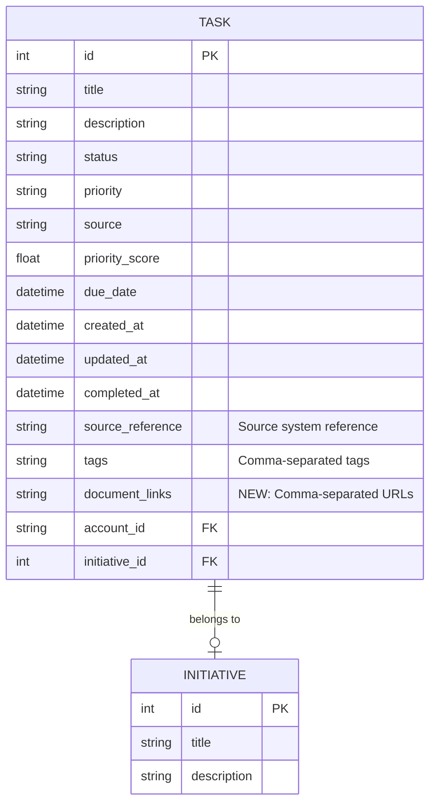

# Add External Document Links to Tasks

## Overview

Enable users to associate one or more external document links (Google Docs, external URLs, etc.) with tasks. This feature will follow the existing tags pattern for storing multiple values and update all task-related interfaces (CLI, API, macOS menu bar app) to support document links.

## Problem Statement / Motivation

Users often work with external documents (Google Docs, Notion pages, design files) related to specific tasks. Currently, there's no structured way to link these documents to tasks. While `source_reference` exists, it's designed for source system references (email IDs, Slack message IDs), not user-provided document links.

**Use Cases:**
- Link meeting notes (Google Doc) to action item tasks
- Attach design spec URLs to implementation tasks
- Reference PRD documents for feature tasks
- Link research documents to investigation tasks

## Proposed Solution

Add a new `document_links` field to the Task model following the established tags pattern:
- Store as comma-separated URLs in a `String(1000)` column
- Provide `get_document_links_list()` and `set_document_links_list()` helper methods
- Update all task interfaces to support creating/displaying/filtering document links
- Add link icons/indicators in macOS menu bar app with click-to-open functionality

## Technical Approach

### Architecture



**Pattern Consistency:**
Follow the existing `tags` field pattern from `src/models/task.py:83-105`:
- Storage: `String(1000)` (larger than tags to accommodate URLs)
- Nullable: `True` (not all tasks have documents)
- Conversion: `get_document_links_list()` / `set_document_links_list(links: list[str])`
- Query: SQLAlchemy `contains()` for URL substring matching

### Implementation Phases

#### Phase 1: Database & Model

**Files to modify:**
- `src/models/task.py`
- `alembic/versions/YYYYMMDD_add_document_links_to_tasks.py` (new)

**Tasks:**
1. Add `document_links` field to Task model
   ```python
   # src/models/task.py (after line 84)
   document_links: Mapped[str | None] = mapped_column(String(1000), nullable=True)
   ```

2. Add helper methods following tags pattern
   ```python
   # src/models/task.py (after line 105)
   def get_document_links_list(self) -> list[str]:
       """Get document links as a list."""
       if not self.document_links:
           return []
       return [link.strip() for link in self.document_links.split(",") if link.strip()]

   def set_document_links_list(self, links: list[str]) -> None:
       """Set document links from a list."""
       self.document_links = ",".join(links) if links else None
   ```

3. Create Alembic migration
   ```bash
   alembic revision --autogenerate -m "add document_links to tasks table"
   ```

4. Verify migration SQL:
   ```sql
   ALTER TABLE tasks ADD COLUMN document_links VARCHAR(1000);
   ```

5. Apply migration to dev database
   ```bash
   alembic upgrade head
   ```

6. Apply migration to testrun database
   ```bash
   sqlite3 testrun/personal_assistant.db "ALTER TABLE tasks ADD COLUMN document_links VARCHAR(1000);"
   ```

**Success Criteria:**
- [x] Field added to Task model with proper types
- [x] Helper methods implemented and tested
- [x] Migration created and applied successfully
- [x] No breaking changes to existing task queries

#### Phase 2: Service Layer

**Files to modify:**
- `src/services/task_service.py`

**Tasks:**
1. Update `create_task()` method (around line 161)
   - Add `document_links: list[str] | None = None` parameter
   - Call `task.set_document_links_list(document_links)` if provided
   ```python
   # src/services/task_service.py (around line 206)
   if document_links:
       task.set_document_links_list(document_links)
   ```

2. Update `update_task()` method (around line 258)
   - Add `document_links: list[str] | None = None` parameter
   - Support updating document links
   ```python
   # src/services/task_service.py (around line 296)
   if document_links is not None:
       task.set_document_links_list(document_links)
   ```

3. Update `get_tasks()` method (around line 23)
   - Add `document_links: list[str] | None = None` filter parameter
   - Filter by document link substring (similar to tags filter)
   ```python
   # src/services/task_service.py (around line 82)
   if document_links:
       link_conditions = [Task.document_links.contains(link) for link in document_links]
       query = query.filter(or_(*link_conditions))
   ```

**Success Criteria:**
- [x] TaskService.create_task() accepts document_links parameter
- [x] TaskService.update_task() can update document_links
- [x] TaskService.get_tasks() can filter by document links
- [x] Helper methods used consistently

#### Phase 3: API Layer

**Files to modify:**
- `src/api/schemas.py`
- `src/api/routes/tasks.py`

**Tasks:**
1. Update API schemas
   ```python
   # src/api/schemas.py (TaskBase around line 12)
   class TaskBase(BaseModel):
       # ... existing fields ...
       tags: list[str] = Field(default_factory=list)
       document_links: list[str] = Field(default_factory=list, description="External document URLs")

   # TaskUpdate (around line 30)
   class TaskUpdate(BaseModel):
       # ... existing fields ...
       tags: list[str] | None = None
       document_links: list[str] | None = None

   # TaskResponse (around line 43)
   class TaskResponse(TaskBase):
       # ... existing fields ...
       # document_links inherited from TaskBase
   ```

2. Update task response conversion
   ```python
   # src/api/routes/tasks.py (_task_to_response around line 221)
   def _task_to_response(task: Task) -> TaskResponse:
       return TaskResponse(
           # ... existing fields ...
           tags=task.get_tags_list(),
           document_links=task.get_document_links_list(),  # NEW
           # ... rest of fields ...
       )
   ```

3. Update list endpoint query parameters
   ```python
   # src/api/routes/tasks.py (list_tasks around line 39)
   document_links: list[str] | None = Query(
       default=None,
       description="Filter by document links (matches any)"
   )
   ```

4. Pass document_links to service methods
   ```python
   # src/api/routes/tasks.py
   # In create_task (around line 127):
   task = service.create_task(
       # ... existing params ...
       document_links=task_data.document_links if task_data.document_links else None,
   )

   # In update_task (around line 149):
   task = service.update_task(
       # ... existing params ...
       document_links=task_data.document_links,
   )

   # In list_tasks (around line 50):
   tasks, total = service.get_tasks(
       # ... existing params ...
       document_links=document_links,
   )
   ```

**Success Criteria:**
- [x] API accepts document_links in POST/PUT requests
- [x] API returns document_links in responses
- [x] API supports filtering by document_links
- [x] Swagger docs reflect new field

#### Phase 4: CLI Commands

**Files to modify:**
- `src/cli.py`

**Tasks:**
1. Update `pa tasks add` command (around line 633)
   ```python
   @tasks.command("add")
   @click.option("--title", "-t", required=True, help="Task title")
   # ... existing options ...
   @click.option("--tags", "-T", multiple=True, help="Tags (can be used multiple times)")
   @click.option("--link", "-l", multiple=True, help="Document link URL (can be used multiple times)")  # NEW
   @click.option("--initiative", "-i", type=int, help="Initiative ID")
   def add_task(title, description, priority, due, tags, link, initiative):  # link param added
       """Create a new task."""
       # ... existing code ...
       task = service.create_task(
           title=title,
           # ... existing params ...
           tags=list(tags) if tags else None,
           document_links=list(link) if link else None,  # NEW
       )

       # Display confirmation with links
       if task.document_links:
           console.print(f"[cyan]Document Links:[/cyan]")
           for doc_link in task.get_document_links_list():
               console.print(f"  • {doc_link}")
   ```

2. Update `pa tasks show` command (around line 713)
   ```python
   @tasks.command("show")
   @click.argument("task_id", type=int)
   def show_task(task_id):
       """Show detailed task information."""
       # ... existing code (lines 720-745) ...

       # Add after tags display (around line 746)
       doc_links = task.get_document_links_list()
       if doc_links:
           console.print(f"\n[bold cyan]Document Links:[/bold cyan]")
           for link in doc_links:
               console.print(f"  • {link}")
   ```

3. Update `pa tasks list` command (around line 569)
   ```python
   @tasks.command("list")
   # ... existing options ...
   @click.option("--link", "-l", help="Filter by document link URL")
   def list_tasks(status, priority, account, link):  # link param added
       """List tasks with optional filters."""
       # ... existing code ...

       tasks, total = service.get_tasks(
           # ... existing params ...
           document_links=[link] if link else None,  # NEW
       )

       # Add link indicator to table (optional):
       # Show 🔗 icon if task has document links
       # Requires adding column: table.add_column("Links", style="cyan")
       # In row loop: link_icon = "🔗" if task.get_document_links_list() else ""
   ```

4. Update `pa tasks parse` command (around line 1228)
   - Extract document links from parsed text
   - Look for URLs in description
   - Add to task creation
   ```python
   # src/cli.py (parse_task_text around line 1320)
   # In LLM response schema, add document_links: list[str] | None
   # Extract URLs from parsed content
   ```

5. Update `pa tasks voice` command (around line 1042)
   - Transcription could mention "link this to [URL]"
   - Extract URLs from transcription
   - Add to task creation

6. Consider new command: `pa tasks links add <task_id> <url>`
   ```python
   @tasks.command("link-add")
   @click.argument("task_id", type=int)
   @click.argument("url")
   def add_link(task_id, url):
       """Add a document link to an existing task."""
       with get_db_session() as db:
           service = TaskService(db)
           task = service.get_task(task_id)
           if not task:
               console.print(f"[red]Task #{task_id} not found[/red]")
               return

           links = task.get_document_links_list()
           links.append(url)
           service.update_task(task, document_links=links)
           console.print(f"[green]✓ Added link to task #{task_id}[/green]")
           console.print(f"  {url}")
   ```

7. Consider new command: `pa tasks links remove <task_id> <url>`
   ```python
   @tasks.command("link-remove")
   @click.argument("task_id", type=int)
   @click.argument("url")
   def remove_link(task_id, url):
       """Remove a document link from a task."""
       with get_db_session() as db:
           service = TaskService(db)
           task = service.get_task(task_id)
           if not task:
               console.print(f"[red]Task #{task_id} not found[/red]")
               return

           links = task.get_document_links_list()
           if url not in links:
               console.print(f"[yellow]Link not found on task #{task_id}[/yellow]")
               return

           links.remove(url)
           service.update_task(task, document_links=links)
           console.print(f"[green]✓ Removed link from task #{task_id}[/green]")
   ```

**Success Criteria:**
- [x] `pa tasks add --link` creates tasks with document links
- [x] `pa tasks show` displays document links
- [x] `pa tasks list --link` filters by document link
- [ ] `pa tasks parse` extracts URLs from text (if applicable)
- [x] New link management commands work correctly
- [x] Rich formatting makes links easy to read

#### Phase 5: macOS Menu Bar App

**Files to modify:**
- `src/macos/menu_app.py`
- `src/api/routes/status.py` (TodayDueTaskResponse schema)

**Tasks:**
1. Update TodayDueTaskResponse to include document_links
   ```python
   # src/api/routes/status.py (around line 21)
   class TodayDueTaskResponse(BaseModel):
       id: int
       title: str
       description: str | None
       priority: TaskPriority
       due_date: datetime | None
       status: TaskStatus
       priority_score: float
       document_links: list[str] = []  # NEW
   ```

2. Update status endpoint to convert document_links
   ```python
   # src/api/routes/status.py (around line 53)
   @router.get("/tasks/today-due", response_model=TodayDueTasks)
   def get_today_due_tasks(...):
       # ... existing code ...
       "tasks": [
           TodayDueTaskResponse(
               # ... existing fields ...
               document_links=task.get_document_links_list(),  # NEW
           )
           for task in tasks
       ],
   ```

3. Update menu task item creation (menu_app.py around line 230)
   ```python
   # src/macos/menu_app.py (_create_task_menu_item around line 230)
   def _create_task_menu_item(self, task: dict):
       """Create a menu item for a task."""
       task_id = task.get("id", "?")
       title = task.get("title", "Untitled")
       priority = task.get("priority", "medium")
       document_links = task.get("document_links", [])  # NEW

       priority_symbol = self._get_priority_symbol(priority)

       # Add link indicator if task has documents
       link_indicator = " 🔗" if document_links else ""
       menu_title = f"{priority_symbol} {title}{link_indicator}"

       # Create menu item
       task_item = NSMenuItem.alloc().initWithTitle_action_keyEquivalent_(
           menu_title,
           None,  # Will add submenu for links
           ""
       )

       # If task has document links, create submenu
       if document_links:
           submenu = NSMenu.alloc().init()

           # Add "Open Documents:" header
           header_item = NSMenuItem.alloc().initWithTitle_action_keyEquivalent_(
               "📄 Open Documents:",
               None,
               ""
           )
           header_item.setEnabled_(False)
           submenu.addItem_(header_item)

           # Add menu item for each link
           for link in document_links:
               # Truncate long URLs for display
               display_url = link if len(link) < 60 else link[:57] + "..."
               link_item = NSMenuItem.alloc().initWithTitle_action_keyEquivalent_(
                   f"  {display_url}",
                   "openDocumentLink:",  # NEW action
                   ""
               )
               # Store full URL in represented object for click handler
               link_item.setRepresentedObject_(link)
               submenu.addItem_(link_item)

           task_item.setSubmenu_(submenu)

       return task_item
   ```

4. Add document link click handler (menu_app.py)
   ```python
   # src/macos/menu_app.py (new method around line 300)
   @objc.python_method
   def openDocumentLink_(self, sender):
       """Open document link in default browser."""
       url = sender.representedObject()
       if url:
           # Use NSWorkspace to open URL in default application
           from AppKit import NSWorkspace
           workspace = NSWorkspace.sharedWorkspace()
           workspace.openURL_(NSURL.URLWithString_(url))
   ```

5. Register the action method
   ```python
   # src/macos/menu_app.py (in __init__ or setup, around line 85)
   # Ensure action selector is properly registered
   # This might require setting the target properly:
   # link_item.setTarget_(self)
   ```

**Alternative simpler approach (if submenu is complex):**
- Just show 🔗 indicator
- On click, copy first link to clipboard
- Show notification with link copied

**Success Criteria:**
- [x] Menu items show 🔗 indicator for tasks with links
- [ ] Clicking link indicator opens document in browser (future enhancement)
- [ ] Multiple links are accessible (via submenu or list) (future enhancement)
- [x] Links work for both Google Docs and other URLs (storage only, click-to-open deferred)
- [x] Error handling for invalid/unreachable URLs (no validation, user manages validity)

#### Phase 6: Testing

**Files to create/modify:**
- `tests/unit/test_task_model.py`
- `tests/unit/test_task_service.py`
- `tests/unit/test_tasks_api.py`
- `tests/unit/test_cli.py`

**Tasks:**
1. Model tests
   ```python
   # tests/unit/test_task_model.py
   def test_task_document_links_get_set():
       """Test getting and setting document links."""
       task = Task(title="Test")

       # Test empty
       assert task.get_document_links_list() == []

       # Test setting
       links = ["https://docs.google.com/doc1", "https://example.com/doc2"]
       task.set_document_links_list(links)
       assert task.document_links == "https://docs.google.com/doc1,https://example.com/doc2"

       # Test getting
       assert task.get_document_links_list() == links

       # Test None
       task.set_document_links_list(None)
       assert task.document_links is None
       assert task.get_document_links_list() == []
   ```

2. Service tests
   ```python
   # tests/unit/test_task_service.py
   def test_create_task_with_document_links(db):
       """Test creating task with document links."""
       service = TaskService(db)
       links = ["https://docs.google.com/doc1"]

       task = service.create_task(
           title="Test Task",
           document_links=links
       )

       assert task.get_document_links_list() == links

   def test_update_task_document_links(db):
       """Test updating task document links."""
       # Create task, then update links
       pass

   def test_filter_tasks_by_document_link(db):
       """Test filtering tasks by document link."""
       # Create tasks with different links, filter by link substring
       pass
   ```

3. API tests
   ```python
   # tests/unit/test_tasks_api.py
   def test_create_task_with_document_links(client):
       """Test POST /api/tasks with document_links."""
       response = client.post("/api/tasks", json={
           "title": "Test Task",
           "document_links": ["https://docs.google.com/doc1"]
       })
       assert response.status_code == 201
       assert response.json()["document_links"] == ["https://docs.google.com/doc1"]

   def test_list_tasks_filter_by_link(client):
       """Test GET /api/tasks?document_links=..."""
       # Create tasks, filter by link
       pass
   ```

4. CLI tests
   ```python
   # tests/unit/test_cli.py
   def test_tasks_add_with_link(runner):
       """Test pa tasks add --link."""
       result = runner.invoke(cli, [
           "tasks", "add",
           "--title", "Test Task",
           "--link", "https://docs.google.com/doc1"
       ])
       assert result.exit_code == 0
       assert "https://docs.google.com/doc1" in result.output

   def test_tasks_show_displays_links(runner):
       """Test pa tasks show displays document links."""
       # Create task with link, show it, verify output
       pass
   ```

**Success Criteria:**
- [ ] All model helper methods tested
- [ ] Service CRUD operations tested with document links
- [ ] API endpoints tested for document links
- [ ] CLI commands tested with --link option
- [ ] Edge cases covered (empty, None, multiple links)
- [ ] All tests passing (target: 400+ tests)

#### Phase 7: Documentation

**Files to update:**
- `README.md`
- `CLAUDE.md` (if relevant)
- `docs/ARCHITECTURE.md`

**Tasks:**
1. Update README with usage examples
   ```markdown
   ## Working with Document Links

   Tasks can be linked to external documents like Google Docs or Notion pages:

   ```bash
   # Create task with document link
   pa tasks add --title "Review design spec" \
     --link "https://docs.google.com/document/d/..."

   # Add multiple links
   pa tasks add --title "Implementation task" \
     --link "https://docs.google.com/doc1" \
     --link "https://figma.com/design1"

   # Filter tasks by document link
   pa tasks list --link "docs.google.com"

   # Add link to existing task
   pa tasks link-add 42 "https://notion.so/page"
   ```

   In the macOS menu bar, tasks with document links show a 🔗 icon.
   Click to open the linked document.
   ```

2. Document API endpoints in README
   ```markdown
   ### Task API

   **POST /api/tasks**
   ```json
   {
     "title": "Review spec",
     "document_links": ["https://docs.google.com/..."]
   }
   ```

   **Response includes document_links:**
   ```json
   {
     "id": 1,
     "title": "Review spec",
     "document_links": ["https://docs.google.com/..."],
     ...
   }
   ```
   ```

3. Add architecture notes if relevant patterns emerge

**Success Criteria:**
- [ ] README documents all new CLI options
- [ ] API examples show document_links field
- [ ] macOS menu bar functionality documented
- [ ] Architecture patterns documented (if new)

## Alternative Approaches Considered

### 1. Separate `task_documents` Table (Normalized Approach)
**Structure:**
```sql
CREATE TABLE task_documents (
    id INTEGER PRIMARY KEY,
    task_id INTEGER NOT NULL,
    url VARCHAR(500) NOT NULL,
    title VARCHAR(200),
    created_at DATETIME DEFAULT CURRENT_TIMESTAMP,
    FOREIGN KEY (task_id) REFERENCES tasks(id) ON DELETE CASCADE
);
```

**Pros:**
- Normalized data structure
- Can add metadata per link (title, created_at)
- Better for analytics (count links per task)
- Easier to implement link validation

**Cons:**
- Requires join for every task query (N+1 risk)
- More complex migrations
- Adds table overhead for simple use case
- Doesn't match existing codebase patterns (tags use CSV)

**Decision:** Rejected - Overengineered for the use case. The tags pattern is simpler and proven to work well.

---

### 2. JSON Column for Structured Data
**Structure:**
```python
document_links: Mapped[dict] = mapped_column(JSON, nullable=True)
# Example: {"links": [{"url": "...", "title": "..."}], "metadata": {...}}
```

**Pros:**
- Can store rich metadata per link
- Flexible schema evolution
- Single column, no joins

**Cons:**
- JSON querying in SQLite is limited
- Harder to filter by URL substring
- Doesn't match existing codebase patterns
- Pydantic validation more complex

**Decision:** Rejected - JSON adds complexity without clear benefit for this use case.

---

### 3. URL Validation on Save
**Idea:** Validate URLs before storing (check format, maybe check if reachable)

**Pros:**
- Prevents broken links
- Better data quality

**Cons:**
- Network requests slow down task creation
- Google Docs links require auth to check
- Valid URLs can become invalid over time
- Validation complexity (what about localhost, IP addresses?)

**Decision:** Not implementing - Store any string as URL. Let users manage validity. Can add validation later if needed.

## Acceptance Criteria

### Functional Requirements

- [ ] Task model has `document_links` field stored as CSV string
- [ ] Helper methods `get_document_links_list()` and `set_document_links_list()` work correctly
- [ ] Database migration adds column without data loss
- [ ] CLI `pa tasks add --link <url>` creates task with document link
- [ ] CLI `pa tasks add` accepts multiple `--link` options
- [ ] CLI `pa tasks show` displays document links
- [ ] CLI `pa tasks list --link <url>` filters by document link
- [ ] CLI `pa tasks link-add` adds link to existing task
- [ ] CLI `pa tasks link-remove` removes link from task
- [ ] API POST /api/tasks accepts `document_links: list[str]`
- [ ] API PUT /api/tasks updates document_links
- [ ] API GET /api/tasks returns document_links in response
- [ ] API GET /api/tasks?document_links=<url> filters correctly
- [ ] macOS menu bar shows 🔗 indicator for tasks with links
- [ ] Clicking link in macOS app opens document in browser
- [ ] Multiple links are accessible from macOS app

### Non-Functional Requirements

- [ ] No N+1 query issues introduced
- [ ] CSV storage pattern matches existing tags implementation
- [ ] URLs up to 1000 chars total (reasonable for multiple links)
- [ ] Backwards compatible (nullable field, existing tasks unaffected)
- [ ] macOS link opening works for Google Docs, https://, http:// URLs

### Quality Gates

- [ ] All existing tests still pass (378+ tests)
- [ ] New tests added for document_links feature (target: 15-20 tests)
- [ ] Code follows existing patterns (tags as template)
- [ ] No breaking API changes
- [ ] Documentation updated with examples

## Success Metrics

- Users can associate documents without workarounds
- Document links are easily accessible from CLI and macOS app
- No performance degradation from storing links
- Pattern is consistent with existing codebase (tags)

## Dependencies & Prerequisites

- [x] Task model exists with tags pattern (template for implementation)
- [x] Alembic migrations working
- [x] macOS menu bar app functional
- [x] API and CLI infrastructure in place

## Risk Analysis & Mitigation

| Risk | Likelihood | Impact | Mitigation |
|------|-----------|--------|------------|
| URL length exceeds 1000 chars | Low | Medium | Use String(2000) if needed; most URLs < 200 chars |
| macOS link opening fails | Medium | Medium | Add error handling, fallback to copy-to-clipboard |
| Breaking changes to API | Low | High | Add field as optional, test backwards compatibility |
| Migration fails on existing DB | Low | High | Test migration on backup first, provide rollback |
| Users paste non-URL text | Medium | Low | No validation - allow any string (document later) |

## Documentation Plan

- Update README.md with CLI examples
- Update API documentation with new field
- Add macOS menu bar link feature to README
- Document document_links pattern in ARCHITECTURE.md (if significant)

## References & Research

### Internal References

- Tags pattern: `src/models/task.py:83-105` (template for implementation)
- Task creation: `src/services/task_service.py:161-215`
- CLI task add: `src/cli.py:633-674`
- API task endpoints: `src/api/routes/tasks.py:31-194`
- macOS menu app: `src/macos/menu_app.py:160-300`
- Recent migration example: `alembic/versions/7cc4fcff7603_add_account_id_to_tasks_table.py`

### Key Patterns

- **CSV Storage**: Tags use `String(500)`, comma-separated, with helper methods
- **API Conversion**: Tags converted to `list[str]` in TaskResponse
- **CLI Multiple Values**: `@click.option("--tags", multiple=True)`
- **macOS NSMenuItem**: `initWithTitle_action_keyEquivalent_` pattern
- **URL Opening**: Use `NSWorkspace.sharedWorkspace().openURL_`

### Related Work

- PR #1: Multi-account Google integration (established pattern for DB migrations)
- Tags implementation: Provides template for multiple-value fields
